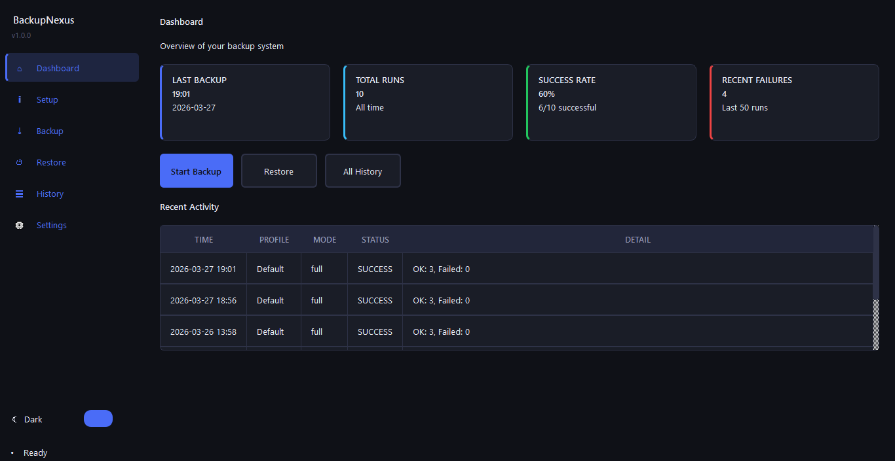
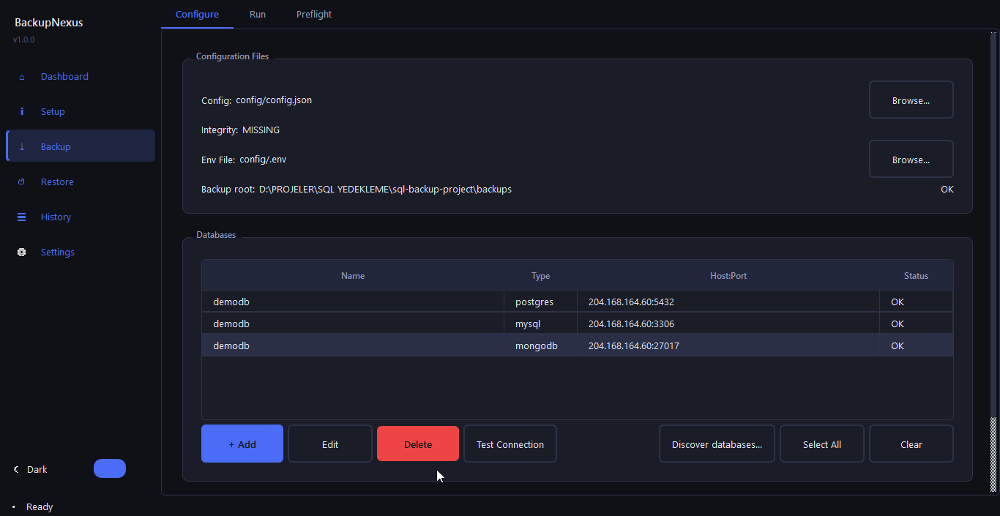
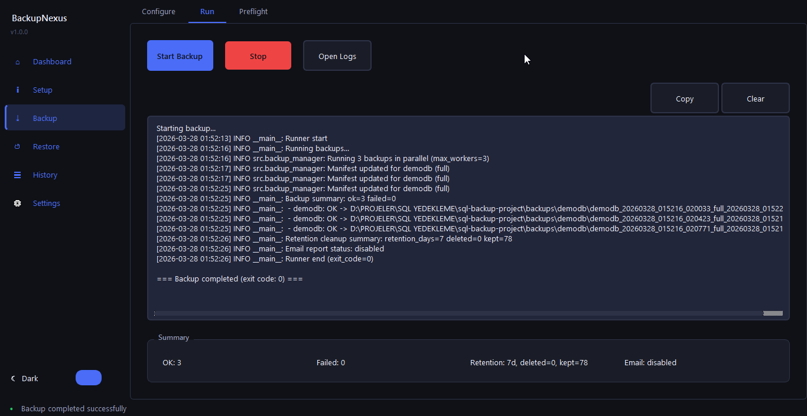
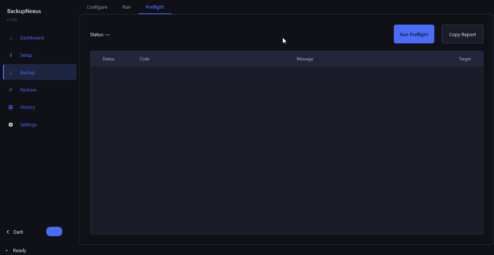
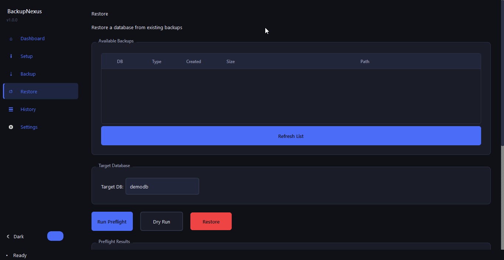
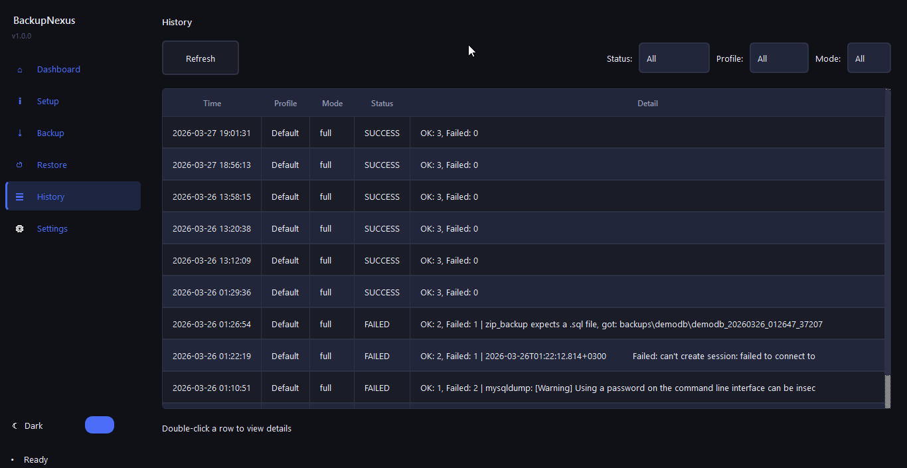
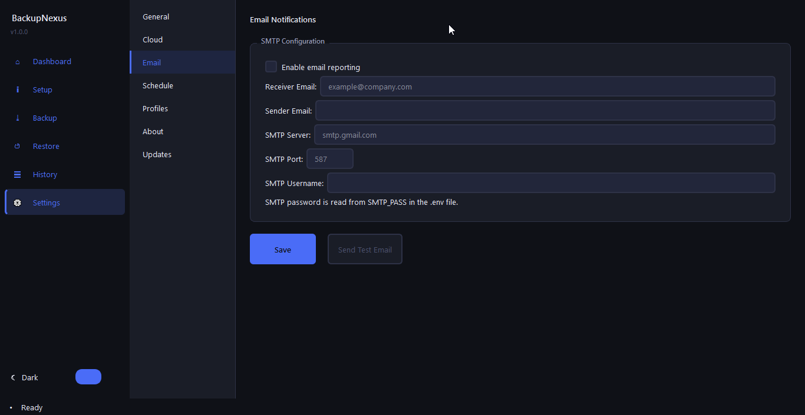
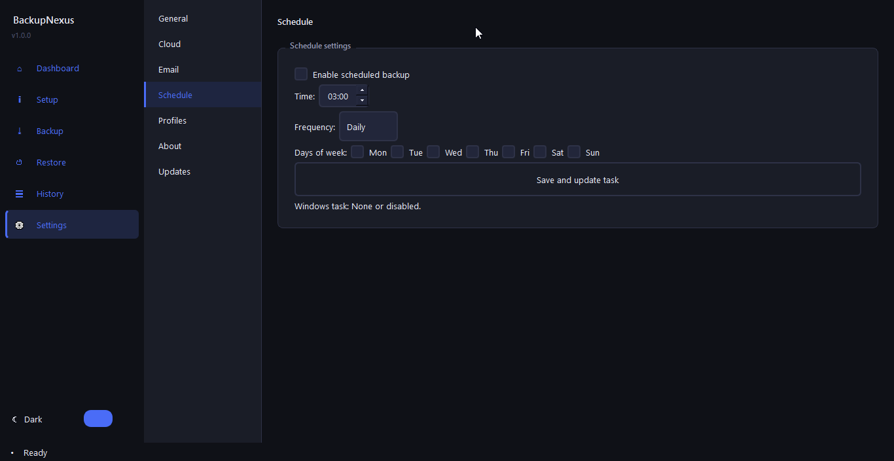
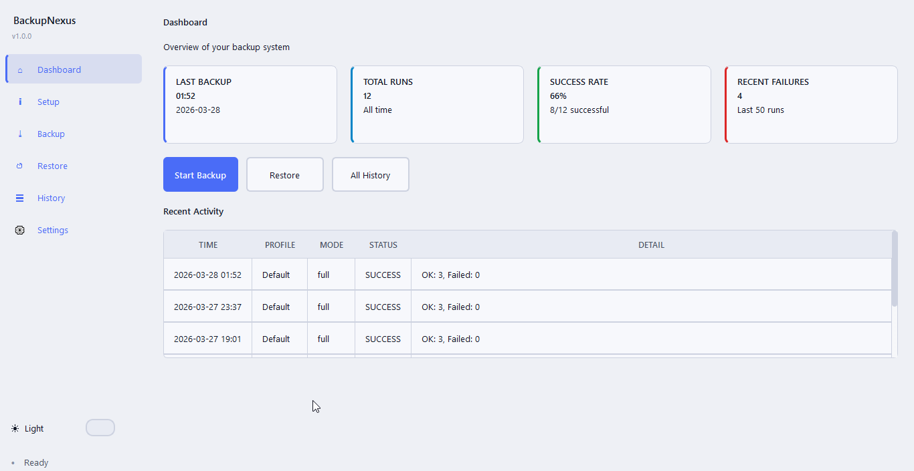

# BackupNexus

> Automated backup & restore tool for PostgreSQL, MySQL, MSSQL and MongoDB — with a modern GUI and full CLI support.


-brightgreen?style=flat-square)

---

<p align="center">
  
</p>

---

## Overview

**BackupNexus** is a professional-grade database backup automation tool for Windows. It provides a clean, modern graphical interface that lets you configure, run, and schedule database backups — without writing a single line of script. Supporting PostgreSQL, MySQL/MariaDB, MSSQL and MongoDB out of the box, it handles everything from one-time full backups to automated incremental backup chains, remote cloud uploads, email reports, and restore workflows — all from a single application.

Designed for developers, DBAs and sysadmins who need a reliable, auditable backup solution without the overhead of enterprise software.

---

## Screenshots

| Dashboard                                         | Backup — Configure                                      |
|:-------------------------------------------------:|:-------------------------------------------------------:|
|            |    |

| Backup — Run                                      | Preflight Check                                         |
|:-------------------------------------------------:|:-------------------------------------------------------:|
|          |                  |

| Restore                                           | History                                                 |
|:-------------------------------------------------:|:-------------------------------------------------------:|
|                |                      |

| Settings — Email                                  | Settings — Schedule                                     |
|:-------------------------------------------------:|:-------------------------------------------------------:|
|  |  |

| Dark Theme                                        | Light Theme                                             |
|:-------------------------------------------------:|:-------------------------------------------------------:|
|          |              |

---

## Key Features

- **4 Database Types** — PostgreSQL, MySQL/MariaDB, MSSQL, MongoDB
- **3 Backup Modes** — Full, Incremental, and Differential backups
- **Preflight Validation** — Checks connectivity, tools, and credentials before every run
- **Real-Time Log Viewer** — Watch backup and restore progress live inside the app
- **Remote Upload** — FTP, SFTP, and Google Drive support
- **Email Notifications** — SMTP-based success/failure reports with configurable recipients
- **Windows Task Scheduler** — Schedule backups daily or weekly directly from the GUI
- **Backup History** — Filterable audit trail with detailed per-run logs
- **Profile Management** — Switch between prod, staging, and dev configurations instantly
- **Dark & Light Theme** — Fully themed UI with instant toggle
- **Multi-Language** — Turkish, English, German, Russian, Japanese, Chinese, Korean, Spanish, French, Arabic, and Swedish interface
- **Integrity Checks** — SHA256 checksums detect unauthorized config changes
- **Audit Log** — Append-only JSONL log of every operation
- **Parallel Backups** — Back up multiple databases simultaneously
- **Standalone Executable** — No Python installation required

---

## Application Walkthrough

BackupNexus is organized into **6 pages**, navigated via the left sidebar. Here is what each page does.

---

### Dashboard

<p align="center">
  
</p>

The Dashboard gives you an instant health summary of your backup environment:

| Card                | Description                               |
|---------------------|-------------------------------------------|
| **Last Backup**     | Timestamp of the most recent backup run   |
| **Total Runs**      | Total number of backup executions         |
| **Success Rate**    | Percentage of successful runs (last 50)   |
| **Recent Failures** | Count of failed or stopped runs (last 50) |

Three quick-action buttons let you jump directly to **Start Backup**, **Restore**, or **All History**. The bottom panel shows the last 5 backup runs with status at a glance — click any row to open the full History page.

---

### Setup Wizard

A guided 4-step wizard for first-time configuration:

1. **Copy Templates** — Creates `config/config.json` and `config/.env` from the bundled examples. Asks for confirmation before overwriting existing files.
2. **Discover Databases** — Scans one or more hosts automatically and lists all detected PostgreSQL, MySQL, MSSQL, and MongoDB instances. Select which ones to add to your config.
3. **Run Preflight** — Validates your configuration: checks that required CLI tools are installed, databases are reachable, and credentials are correct. Shows a full report with ERROR / WARN / OK indicators.
4. **Go to Settings** — Navigates you to Settings to complete email, cloud, and scheduling configuration.

---

### Backup

<p align="center">
  
</p>

The Backup page has three tabs:

#### Configure Tab

- **Configuration Files** — Set paths to your `config.json` and `.env`, with live integrity status (OK / MISMATCH / MISSING).
- **Database Selection** — Checkbox list of all configured databases (name, type, host:port). Enable all or select specific ones. Edit entries via the inline editor.
- **Backup Mode** — Choose between **Full Backup** (complete dump) or **Incremental Backup** (only changes since last full).
- **Targets** — Enable/disable Local storage and Google Drive upload per run. Set email recipients and retention period (days).

#### Run Tab

<p align="center">
  
</p>

Click **Start Backup** to open the Run Summary dialog — it shows exactly what will run (selected databases, targets, integrity status) before committing. Once confirmed:

- An animated progress bar indicates the backup is in progress.
- The real-time log viewer streams every step as it happens.
- A **Stop** button lets you cancel a running backup safely.
- On completion, a result dialog shows which databases succeeded or failed, retention cleanup stats, and email delivery status.

#### Preflight Tab

<p align="center">
  
</p>

Run preflight checks independently before committing to a backup. The results table is color-coded:

| Color  | Severity | Meaning                                |
|--------|----------|----------------------------------------|
| Red    | ERROR    | Will prevent backup from running       |
| Yellow | WARN     | May cause issues, proceed with caution |
| Green  | OK       | Check passed                           |

---

### Restore

<p align="center">
  
</p>

The Restore page provides a safe, step-by-step restore workflow:

1. **Select a Backup** — A table lists all available backups (database name, type, creation time, file size, path). Click **Refresh** to reload.
2. **Select Target Database** — Choose which database to restore into from the dropdown.
3. **Preflight** — Validate that the restore will succeed before touching any data.
4. **Dry Run** — Simulate the restore without making changes (runs preflight + mock restore logic).
5. **Restore** — Execute the actual restore. A confirmation dialog requires you to type `RESTORE` to prevent accidents.

Progress and all restore steps are shown live in the log viewer below.

---

### History

<p align="center">
  
</p>

A complete, filterable audit trail of every backup run:

- **Filter by Status** — All / Success / Failed / Stopped
- **Filter by Profile** — Narrow to a specific environment profile
- **Filter by Mode** — All / Full / Incremental

The history table shows timestamp, profile, backup mode, status, and a summary of results. Double-click any row to open the **Detail Dialog**, which includes:

- Full timestamps, profile name, config path
- Result counts: databases OK, databases failed
- Retention stats: files deleted, files kept
- Email delivery status
- Error summary (if any)
- **Copy JSON** button to export the raw record for external analysis

---

### Settings

<p align="center">
  
</p>

Settings is divided into 7 sections, selected from a left-side list:

#### General
- **Read-Only Mode** — Disables all backup and restore execution (useful for audit-only access).
- **Theme** — Toggle between Dark and Light mode instantly.
- **Language** — Switch the interface language between Turkish, English, German, Russian, Japanese, Chinese, Korean, Spanish, French, Arabic, and Swedish.

#### Cloud (Google Drive)
- Enable Google Drive uploads.
- Set paths to your Google service account credentials JSON and token file.
- Set the target Google Drive Folder ID.

#### Email
- Enable SMTP email notifications.
- Configure receiver, sender, SMTP server, port, and username.
- Passwords are read from `config/.env` (never stored in config.json).
- **Test** button sends a verification email to confirm connectivity.

#### Schedule

<p align="center">
  
</p>

- Enable scheduled backups via Windows Task Scheduler.
- Set the backup time and frequency (Daily or Weekly).
- **Create / Update Task** registers the scheduled task in Windows Task Scheduler.
- **Delete Task** removes it.
- Shows the task's next scheduled run time.

#### Profiles
- Save the current configuration as a named profile (e.g., `production`, `staging`).
- Switch between profiles from a dropdown — each profile has its own `config.json` and `.env`.
- Rename, delete, or set a profile as the default on startup.

#### About
- Displays the installed version and application information.

#### Updates
- Check for newer versions with a single click.
- Shows current version vs latest available.
- Download and install updates from within the application.

---

## System Requirements

| Requirement          | Details                                             |
|----------------------|-----------------------------------------------------|
| **OS**               | Windows 10 or Windows 11 (64-bit)                   |
| **Python**           | Not required — standalone `.exe`                    |
| **PostgreSQL tools** | `pg_dump`, `psql` (if backing up PostgreSQL)        |
| **MySQL tools**      | `mysqldump`, `mysql` (if backing up MySQL/MariaDB)  |
| **MSSQL tools**      | `sqlcmd` (if backing up MSSQL)                      |
| **MongoDB tools**    | `mongodump`, `mongorestore` (if backing up MongoDB) |

Database CLI tools only need to be installed for the database types you actually use. They must be accessible on your system PATH (or configured via `config.json`).

---

## Installation

1. Download the latest release from the [Releases](../../releases) page.
2. Extract the zip file to your preferred directory.
3. Run `BackupNexus.exe`.
4. On first launch, enter your license key to activate.

---

## Quick Start Configuration

BackupNexus separates **settings** from **secrets**:

- **`config/config.json`** — Database connections, backup targets, email server, scheduling. No passwords.
- **`config/.env`** — Passwords only (`DB_PASS`, `SMTP_PASS`, `FTP_PASS`, etc.).

The **Setup Wizard** (sidebar → Setup) creates both files from templates and guides you through the entire process. If you prefer to configure manually:

**`config/config.json`** (minimal example):
```json
{
  "backup_root": "backups",
  "databases": [
    {
      "name": "myapp",
      "type": "postgres",
      "host": "localhost",
      "port": 5432
    }
  ]
}
```

**`config/.env`**:
```
DB_USER=postgres
DB_PASS=your_password_here
```

---

## Pricing & License

**BackupNexus** is a commercial product available as a one-time lifetime purchase.

| Plan                 | Price | Details                                                           |
|----------------------|-------|-------------------------------------------------------------------|
| **Lifetime License** | $50   | Single user · Up to 1 devices · Lifetime access · No subscription |

[**Buy Now →**](https://metaldev.lemonsqueezy.com/checkout/buy/d9a2b152-3fea-4e43-bedb-b028a683eed4)

> Your license key will be delivered by email immediately after purchase.
> Enter it in the application on first launch to activate.

This software is proprietary. Redistribution, reverse engineering, or sublicensing is not permitted. See [LICENSE](LICENSE) for full terms.

---

## Support

For license issues or technical questions:

📧 backupnexus.support@gmail.com

---

## Language

- 🇹🇷 [Türkçe README](README.tr.md)
